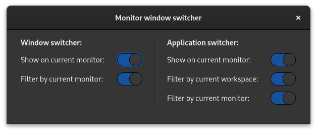

# Monitor window switcher

GNOME shell extension to improve the window or application switcher on dual (or more) monitor setups. It has the following options:

- Shows the window or application switcher on the current monitor (instead on primary monitor).
- Filter windows or applications by the monitor they are open on (instead of windows or applications opened in all monitors).
- Filter applications by the workspace they are open on (instead of applications opened in all workspaces).

&nbsp;

Get it on GNOME extensions: https://extensions.gnome.org/extension/4164/monitor-window-switcher/
